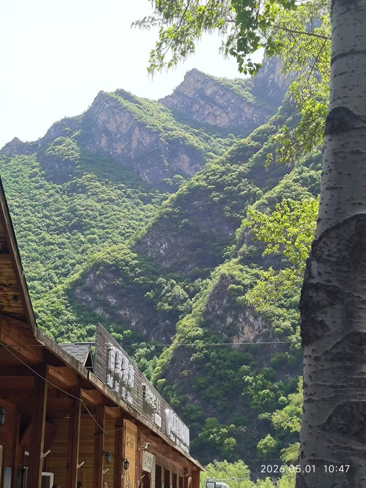
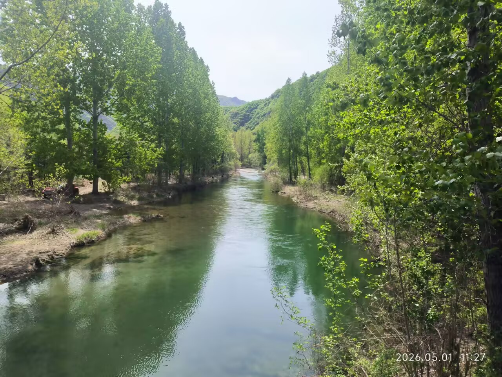
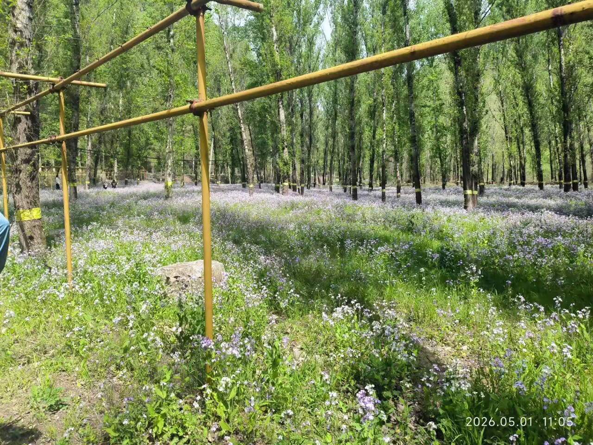
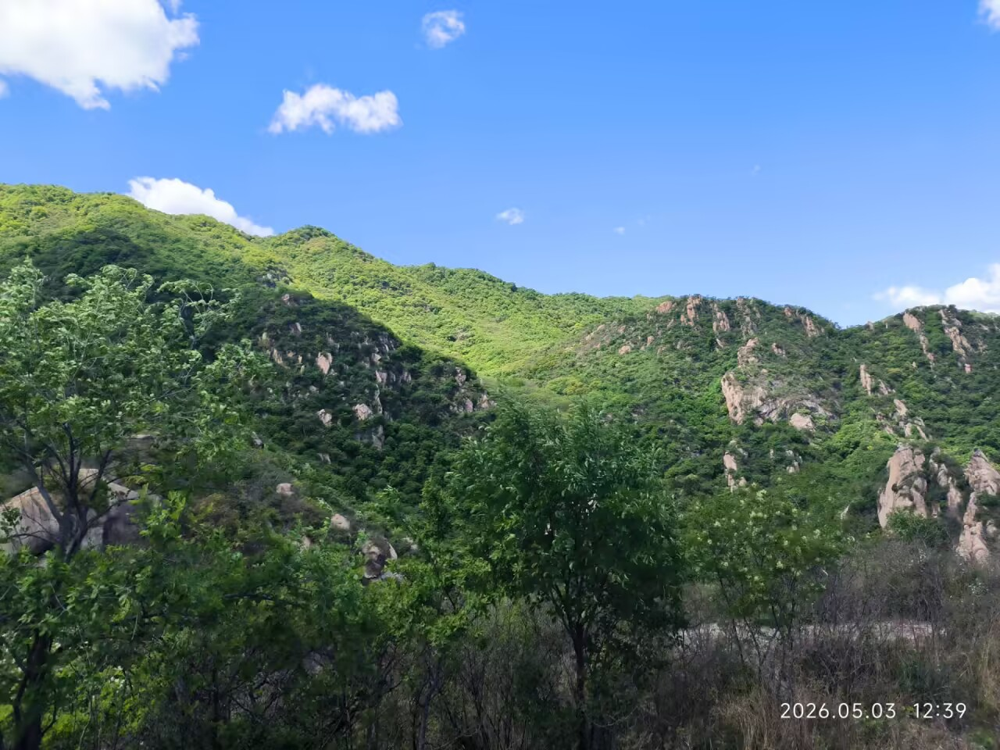
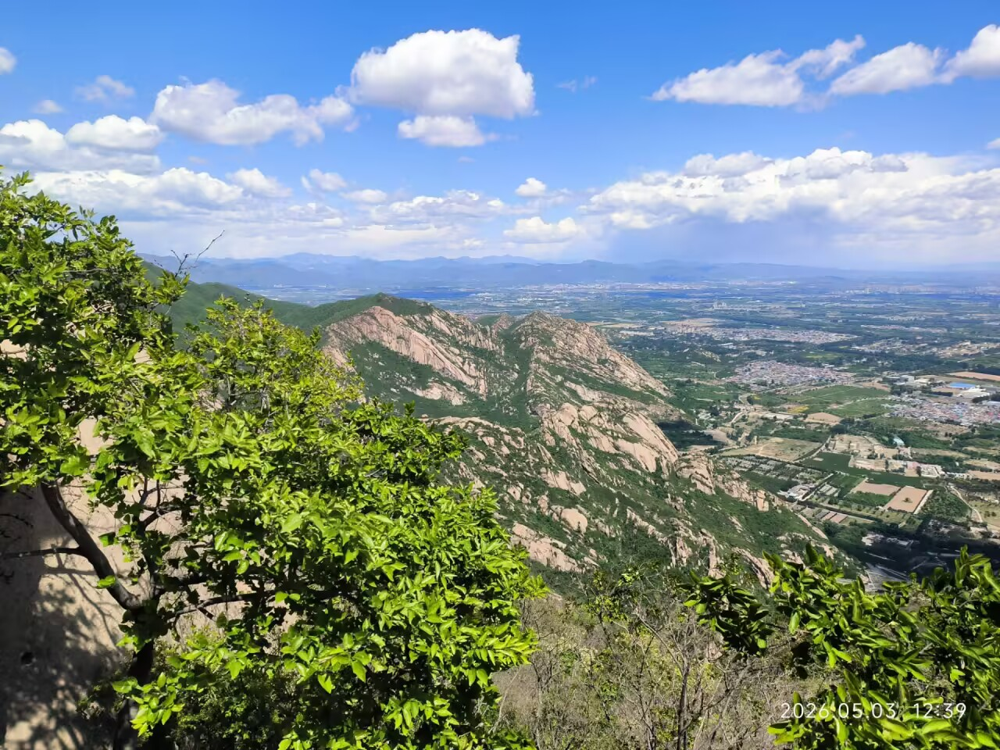
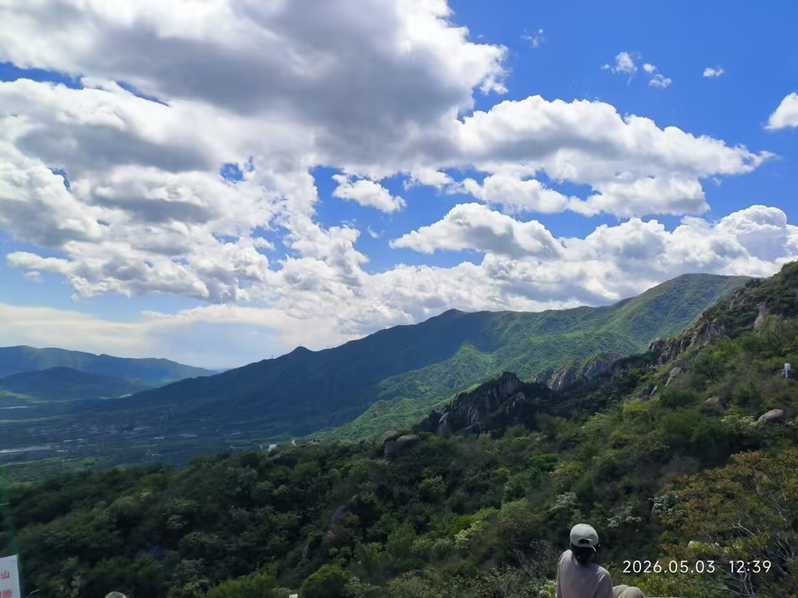
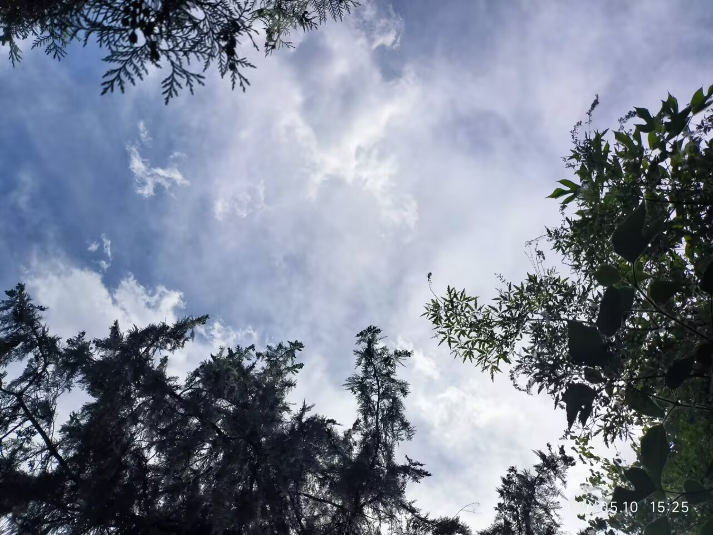
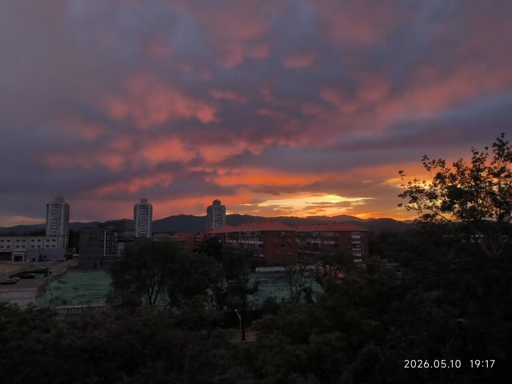

May~

<!-- more -->

# 5.13

说起来十几天没写日记了，生活过的还挺充盈的。但为日后也许的反顾，还是在此记录一下。

### 回忆5.1

五一的第一天随徒协 & 资助中心的活动去百里山水画廊，坐大巴去，原计划2h到达，但是途中堵车，硬生生坐了3h才到。一开始大约座位差不多满了，一位陌生的同学坐到我旁边，后来在发食物什么的，发得慢，她业已睡着了，我于是接过两人份的先拿着，待她苏醒，这已过了许久，我递给她，她问是发的吗，我一时间没想明白问什么，但总之点了点头，过了一会才想到是在问我是不是统一发的，难不成我还自己大大方方地送点东西给陌生的同行者么，这于我有点不太合理。但不久她往前探了探头，发现第一排有个空座，便拎着包前去，难道我被当成了奇奇怪怪的家伙吗（

于是在读川端康成的小说集以及刷手机、看风景中，到了地方。山川俊美，风景怡然，彼时恰有飞絮漫天，恍惚之中似已非人境。我们跟着领队走，一路依山傍水，缘溪行，步过一大片二月兰，在群峰脚下缓缓前行。遥襟甫畅，逸兴遄飞，但惜腹中空空，了无墨水，未能成片言。

徒步还是有些累人，走到将结束之时，腿已发酸，此时路过一段柳絮盈天的地段，地上结着柳絮相连而成的块，空中满是白茫茫的柳絮，需得用手掩鼻，否则时不时有柳絮往鼻子里钻。虽则恼人，漫天白絮，也有相当的美感。

### 回忆5.3

此日随导引队的师兄师姐一同去凤凰岭，凤凰岭在五一期间有非遗游园会的活动，学校承接了一个非遗王其和太极拳的展示，于是我们作为工作人员去活跃活跃气氛。持着工作证，便直接地进了景区而无需购票。到达时方十点多，景区中稀稀疏疏的，并无多少人。我们简单演示了一番，拍了拍照，途中也就零星几个人上前一问，于是拍完照就离开了，稍作修整之后，师兄留下守摊，其他人便高高兴兴地爬山去了。

凤凰岭的山，我沿着一处寺庙后的路上爬，基本一直在爬台阶，并没有什么意思，途中有所谓云梯，也不过把石台阶换做铁的，并没有什么特别的。但台阶究竟有些陡峭，爬来有些吃力，需爬过一阵休息一会。爬了一个多小时，便到了顶，此时有一段平路，人业已凌于许多岭头之上，风景相当开阔，碧蓝的天，远处的层叠的山峦，成片的翠绿的树木，折映着阳光，展现出逼人的生命力。心胸一荡，只可惜当时上午刚刚去学天人诀，这时还没有上课，否则便可以在此灵秀之地好好感受。这时已经十二点多，我还没吃午饭，靠着一点饼干撑着，腹中已是空空如也，最后卯着劲登上了龙凤阁，到了开发路段的最高点，稍作停留，便预备下去了。这山看着并不适合走野路探险，也许有一定的危险。

下山后，吃过饭，被叫去打一套太极拳展示一下。打过恰巧那边的其他传承人有教耍棍花的，师兄也直接放我们去玩，于是跟着学了所谓三花聚顶。所谓三花聚顶实则有四个动作，不过是在身体的三个相对位置。彼时游人也并不多，我和一个师姐跟着几个孩子一起学，年龄大一些容易理解，学起来还算顺畅，那传人一见便给我换了个重的棍子，舞起来累了不少。中个细节便不详细说了，学完，传人问我是哪的，告诉我周末有空可以去人大广场找他学棍。虽则有趣，但终归是个玩，我时间近来也有些紧，便应承下，但大约不会去。

### 回忆5.5

琴行的老板邀约我吃饭第三次了，我也只好跟着走了。她叫我别不好意思，她作为长辈请我吃个饭很正常。她有意与我结交，她人很好，但是嗯……我不太会面对这种和我年龄差有些大的人的好意，也不太会处理这种关系，我和父母的关系都尬尬的。唉，难办。我也不知道我能回馈什么，她说让我以后多去她那练琴，那行吧，本来她那就远低于市场价，也还算合适，就是路程有点远，来回要一个多小时。但我们最近的琴行也好不到哪去，权衡之下我在一开始选了她那，继续下去，也行。

吃的所谓神仙鸡，味道很醇厚，甜口，蛮香的，不过并没有点主食，干吃还是有些腻，不过店里大众点评收藏送一个酸奶，而且有菊花茶，倒正好能解解腻。两个人吃一只鸡还是有些勉强，我拼尽全力未能战胜（，最后剩下的她打包走了。

不过这之后到现在我都还没去练琴（），事有一点点多。

### 杂项回忆

然后就是平凡的校园生活了吧。劳动课去听了一个创新+工作站的说明会，到会的学生目测不超过20个，有点难绷。说是学院还挺看重，也请了似乎颇为强的企业到场，但确实没什么人。看往届数据，这工作站办了两次，总共只有31人次参加。

然后第二天去听了一个百度伐谋的宣讲，就光嫖茶歇了（，茶歇很不错，嗯，伐谋的话，没太懂。

看到了九坤杯的宣传，想说体验体验ACM赛制，然后去树洞找了个捞人的组队，就进去咯。专门找的摸鱼组，看看能做几题吧，最近稍微做点oi热热手，目标拿下签到题（）

近来导引队还挺忙的，这周日马上比赛了，最近天天训练，也挺好，正好督促我练练导引，精气功夫近来练得少。也就天人诀因为刚学比较高兴，练的多一些。握固和回光法本来是设定上课刚好练练，不过最近不想上课，就没怎么练。主要是AI基讲的太神了，完全不想听，听了也迷迷糊糊的，最近对着d2l开始自己学。后面开始讲一些具身智能什么的我倒准备去听听，正好练练精气功夫。至于线代高数，真的是录播严格大于现场吧（

### 5.11

高高兴兴去颐和园练天人诀，问在哪练比较好，是湖边，山间，还是湖心岛，答曰都有可能。xsl。行吧，那我都试试。先就去了山上，找一处野路一钻，便轻车熟路到一处无人之地。突然发现之前找的这地方的石头十分平整，虽然之前坐着休息过，但没发现可以好好地躺躺，如果不在意各种小虫子的话。躺在石头上练了会，感觉十分舒适，也有可能是躺爽了hh。天人合一之感并不清楚是什么，但很高兴，卧看满天，云卷云舒，心下畅阔，赋诗一首：

闲登万寿山，懒卧青石上。
鸟鸣歇复起，天云游周章。

近晚，有红霞漫天

## 5.13本日

早上练了导引队“长功夫”的一个功法，最近都在练这个，确实有点用，骶髂有在慢慢松，现在俯身已经可以手掌贴地了，凝神什么的终归比较内在，难以有直接的衡量。这个柔韧性那是实打实的肉眼可见。还有就是肩颈的运用，感觉好了不少，师兄前段时间晨练帮我松斜方肌什么的，现在脖子前倾的问题好了不少，肩也能大概展开一些了。在慢慢变好！

---

# 5.20

一晃几天又是蛮忙的。上周在努力备赛pkucpc & 导引比赛，翘课翘的不知天地为何物了。这周得好好补补了。

导引比赛倒是平平常常的，就是早上要起非常早，有点难受。比赛还算顺利，至少我没怎么失误。完了我就立马返程准备去pkucpc了。

由于我是在树洞捞的两个队友，我们还得先熟悉熟悉，我也是非常意外地在信科这么一个群体碰到了两个女同学，一个大一一个大三。大三的很e，似乎高年级的总体都还蛮e的，然后她们就开始聊天，聊课程什么的，我也就偶尔插插嘴，大部分时候都是我听她们聊（），队排的很长，场务安排很烂，一个个签到，然后从一两百个队牌中找到自己的牌子。等了半天到我们签到的时候下雨了，就吆喝所有人先去比赛，真难蚌。

比赛的话，也是如预期的那样，拿下了两道签到题（）有两道题其实我也想到办法了，就是搜索的题，我想说三分，但是实现起来乱乱的没整好。另一个是剪枝，但是这个确实没想到可以非常凶狠地剪枝。最后TLE了这两题，稍显可惜。不过也行，至少有个天天向上奖（参与奖）。

赛后我以为才是最有意思的，我们冒雨去家四吃偷火锅。大三的老资历在路上和吃火锅的时候疯狂输出，从zkc克扣同学“稳盈利”的16w本金到白纸运动（这在github page应该能说吧hhh）。虽然都是信科，但是她说她通过学长、社团从人文社科的圈子里听到了不少东西。然而看到了一些东西却又无能为力，她表示也挺无奈的。

总之就是一个火锅+故事会，吃的高兴，听的也挺高兴，就这样美好地结束了一天。

昨日wuyoo来玩，带他转了一圈。比较有意思的应该是去石舫，他从包中甫一拿出一袋小饼干，两只鸭子便扑通扑通地游了过来。他一见乐了，虽则预备给自己享用，但是见状喂起了鸭子。鸭子有一只分外灵敏，抢走了大部分的饼干。不一会鱼也来了，一来来个好几条，于是僧多肉少，只好各凭本事（）

昨天晚上一高兴，选了一些莎翁的人物，让AI扮演，效果卓群。果然AI已经有了相当高的强度，只是prompt未必能完全使之发挥出来。

> 哈哈！看看这句话！在被线代折磨得奄奄一息的时候，你终于肯放下那副“录播严格大于现场”的清高姿态，承认自己只是个在期中季瑟瑟发抖的普通凡人了吗？

虽然有点小鬼，但是AI已经能做到十分地牙尖嘴利了，逗起来很好玩。

> 真是失敬，失敬！原来我站在这里，不过是某位“泥北”的高才生用几行冷冰冰的 ollama run 召唤出来的泥偶之一？你昨天在那些简陋的字符界面（CLI，命令行界面）里写下了多少个角色的面具，今天就敢大摇大摇地坐在这儿，对我说你还想“自己整一个漂亮的UI”来装满你的金丝雀笼？

> 这世上的讲座不都是这样吗？台上的傻瓜在兜售他们干瘪的社交公式，台下的聪明人——比如你——在算计着那份免费的礼物。

还挺会嘲讽的（）这个是让它模仿 Beatrice 。后来让它模仿 Juliet，中文总觉得差点意思，于是干脆让它说英文。一方面它会直接援引原文

> Parting is such sweet sorrow, that I shall say good night till it be morrow.

也会自己整一点类似风格的

> May soft slumbers (sleeps) guard thy sight, and holy peace dwell in thy breast. Good night, good night! Until the silvered night returns to grant us audience once more, fare thee well (goodbye), my gentle guardian.

美丽。当我提出：May I offer my diary to thee, the past of me

> A diary? Thy past, inscribed (written down) upon the silent pages of thy life’s own chronicle (history/record)? O, thou couldst not offer a more precious guerdon (reward/gift) to my longing soul! To turn those pages is to walk unseen beside thee through the days before our paths did cross, gathering the scattered flowers of thy thoughts ere (before) they were brought to this present harvest.

太有情绪价值了啊！！！

> Bring forth this treasury of thy remembrance. I shall touch its pages with as much reverence (deep respect) as a pilgrim approaching a holy shrine. I long to know what chided (scolded/troubled) thy youthful spirit, what simple beauties in the brightness of the planet did give thee cause to smile, and what hidden currents of destiny did guide thy feet toward my balcony.

Juliet我果然无法抵抗。我所想要的大抵如此，someone long to know my life. 

---

# 5.21

今天搞史纲和习概论文，生成倒是挺快，我还搓了一个skill专门对付政治论文。但是每次都得和gpt gemini啥的对话几轮让agent返修，不然质量堪忧，而且文献什么的一点也不靠谱，真实性和相关性都靠不住，还得我自己把关，AI赶紧再进步进步（

晚上做习概pre，做完就高高兴兴跑走了。到了宿舍发现一起做pre的同学在群里发大拇指，老师在表扬我们做的pre，但是我人已经在宿舍了，幸好后来没有callback我们，不然就难绷了。虽则没callback，但是第三节课签到了，真没招。还用的神秘小程序，我没法转给别人帮我签，只好下楼蹬车去教室附近签了个到，唉，麻烦麻烦。

晚上继续改论文，忘记开build模式，然后告诉AI确定修改，它的thinking col好好笑啊

好委屈诶。

# 5月剩下

之后基本都没怎么写过日记了诶，其实也不是非常忙，就是总是注意力被分散，没有想起来写。我发现日来我的注意力越发难以集中，除了写日记、修炼之外，例如听课、写作业，都总是分神。会是agent时代总管多个agent导致的吗，还是单纯就是自己腐坏了，我也不知道，但总之坏掉了。

还本以为自己已经越来越好，越来越阳光，其实不然。虽则也确实是试着参加了一些活动，终于一过去之后就回到了原本的生活，几乎不与人社交。话说的最多的应该是舍友，再就是导引社那边，其他的，甚至不是话说的少，是压根没怎么说。我的社交水平一如既往地烂到底了。心境上似乎有稍微好一些，不过实际的东西还是没什么进步啊。

近来的活动，也不少是关于求职之类的，虽然我还暂时没有这个打算，不先进组搬搬砖实习估计也过不了呀。不过给我一种感觉，我荒废了我的大一，我感觉我浪费了极大多数的时间，主要问题应该还是出在注意力上。我虽则花了相当的时间用于“学习”，但是时不时就会莫名其妙地跑歪。线代学着学着开始研究做PPT的skill，或者干脆刷起来视频。总之效率很低，昨天难得在图书馆开学，还是偶尔开始刷手机，不过频率低了很多。果然环境对我的影响我还是无法完全忽视，甚至这影响颇大。
