复活中

<!-- more -->

---

今天到了下午，兴许受了昨天出游的攒动，也干脆出去兜兜风。一看时间业已3点多，想说或许便不去园博苑了，随便逛逛便是。

便沿着海边一路骑。先是到了一处公园，主体是湖，边上是高耸着的富丽堂皇的酒店

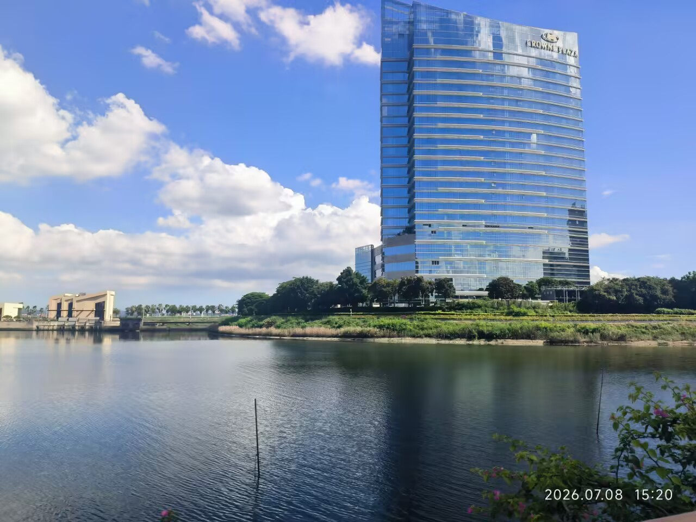

这酒店选址颇有品位，这个角度看去十分好。当然，在酒店上大约也有很好的风光，湖对岸是马路，再过去便是海

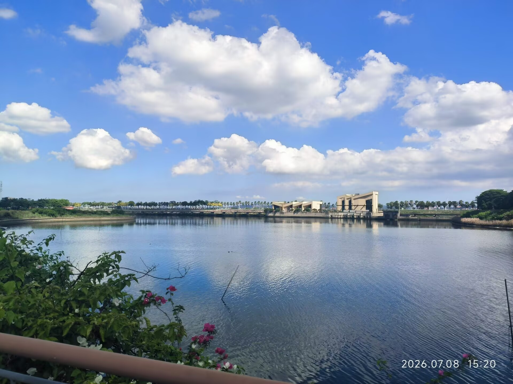

天地之辽阔，真让人心胸一荡。沿湖骑着，忽而树丛边稀稀疏疏一阵响，飞出几只白鹭

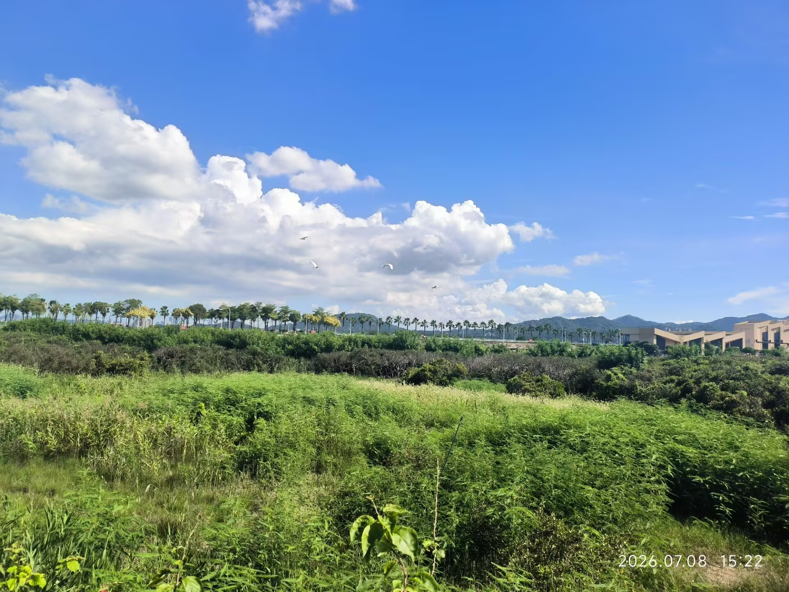

白鹭洲之名，也算不愧对。似乎处处都能见到白鹭。

继续向前骑，又碰上一座金碧辉煌的酒店。

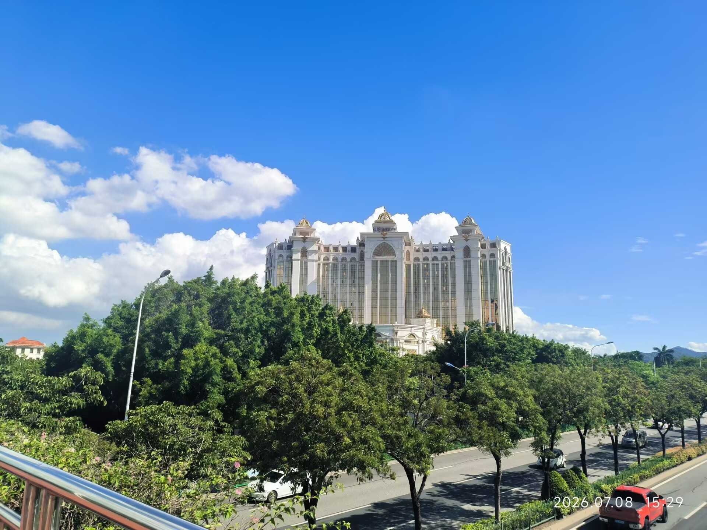

风光着实好，这酒店说是酒店，看上去并不比城堡差，气派得很。这是在天桥上拍的，过了天桥我便去海边的路上

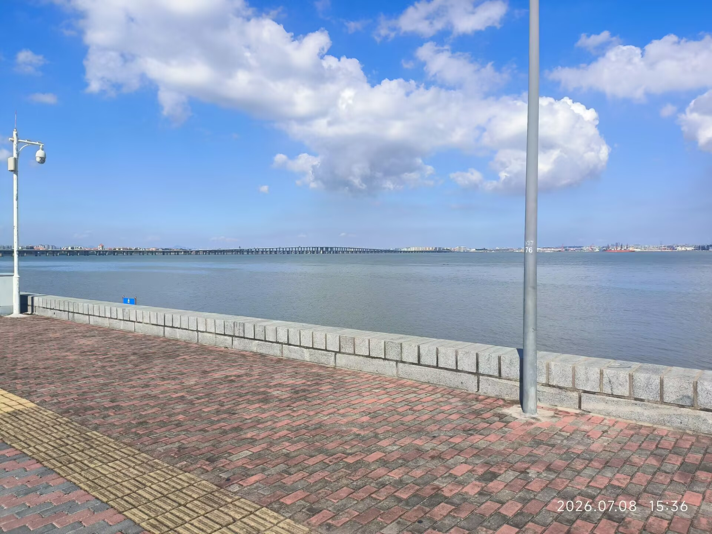

沿海有一条宽敞的自行车道，此刻大约因为是工作日，路上人不多。宽敞的道路，上好的晴天，温和的海风，我的心于是轻飘飘的，领受到一种美好的满足。

骑行不久，自行车道一拐，一下从海边的宽敞，到了高架桥底下似乎略狭窄的地方。周围绿化十分足，就连高架桥上都布着绿植。我忽而感觉这是一个很好的机位，便停下来拍了一张。

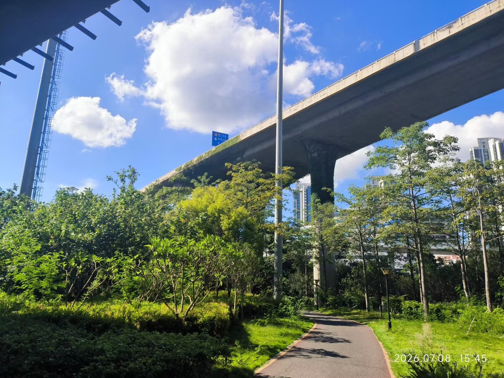

骑着骑着，好像意外地就到了原先想过去的园博苑附近，索性就去转了转。实际上，在我读小学时，我被领着去过数次，但我一回想，竟然什么记忆都不剩，只有一个粗浅的印象，告诉我这里没什么意思。但是我一进去，就不由地赞叹这里的美好，小孩子懂什么hh。

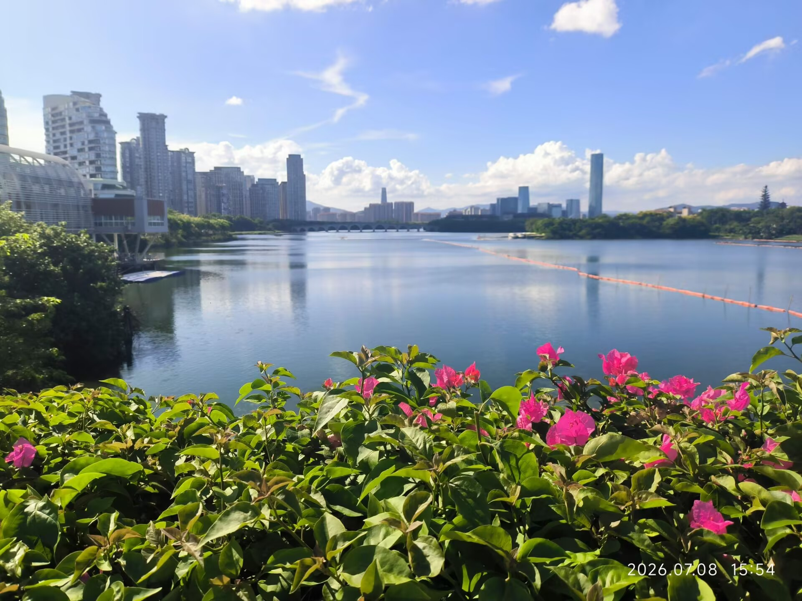

甫一进门，便是宽敞的湖，倒映着碧蓝的天，这颜色都相当漂亮。往里走走，我便对着导航准备去江南园林看看，我在小红书上先前刷到过，主要就是想看看这个。江南水乡，小桥流水，亭台楼阁，配上细柳、荷花，黑白配色的并不高的房屋，真是再温柔不过的景色了。我在网上看过不少江南的视频，也由此生出了很浓的向往。

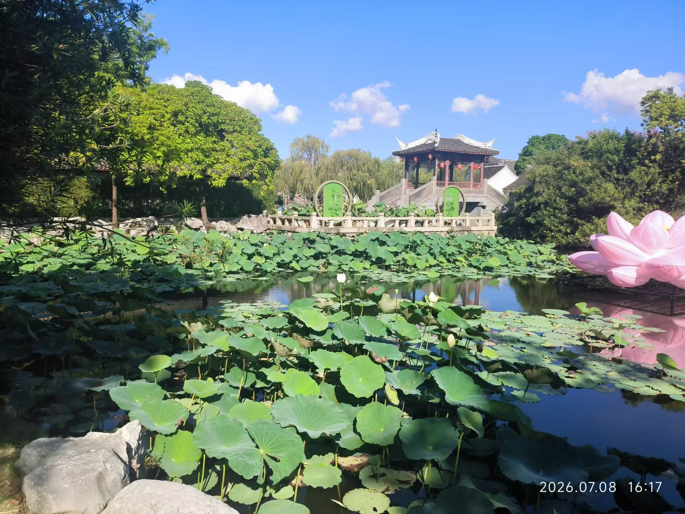

园博苑也并没有让我失望，江南园林的景色还蛮符合我的印象，我看牌子，似乎是江浙一带的政府捐赠的。但这朵巨大的人工造的荷花，我以为有些糟糕。
一进门，实际上先会看到左侧的小院

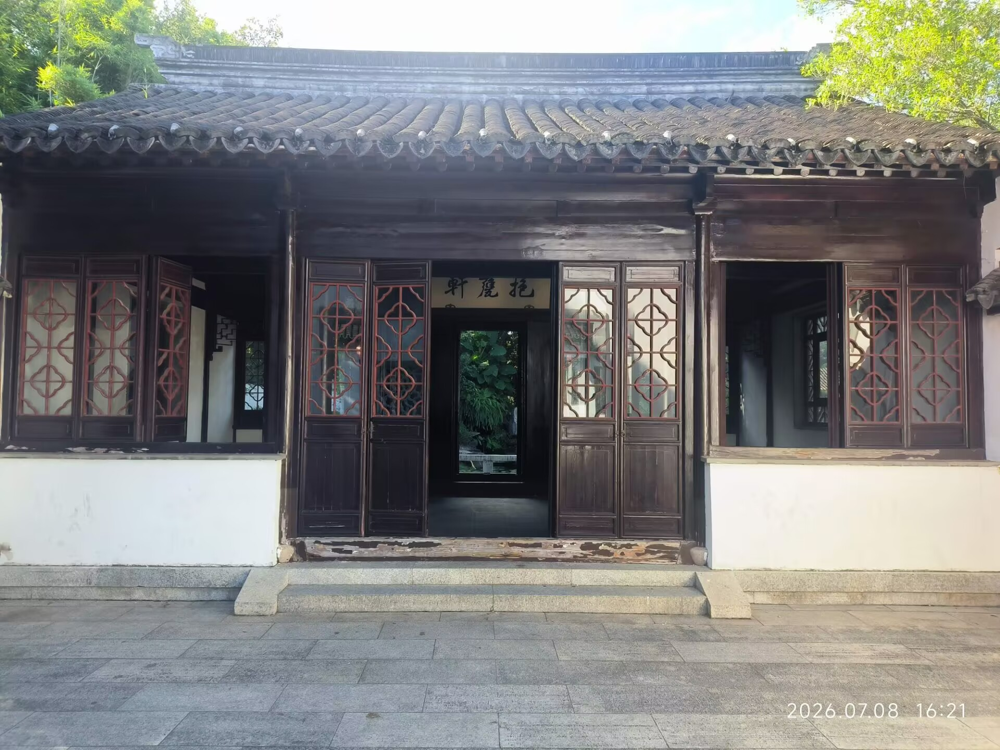

建筑也颇有味道，门后是小院里边，有修长的竹与树。越过小院往前走，便是水乡那种水道纵横般的布置

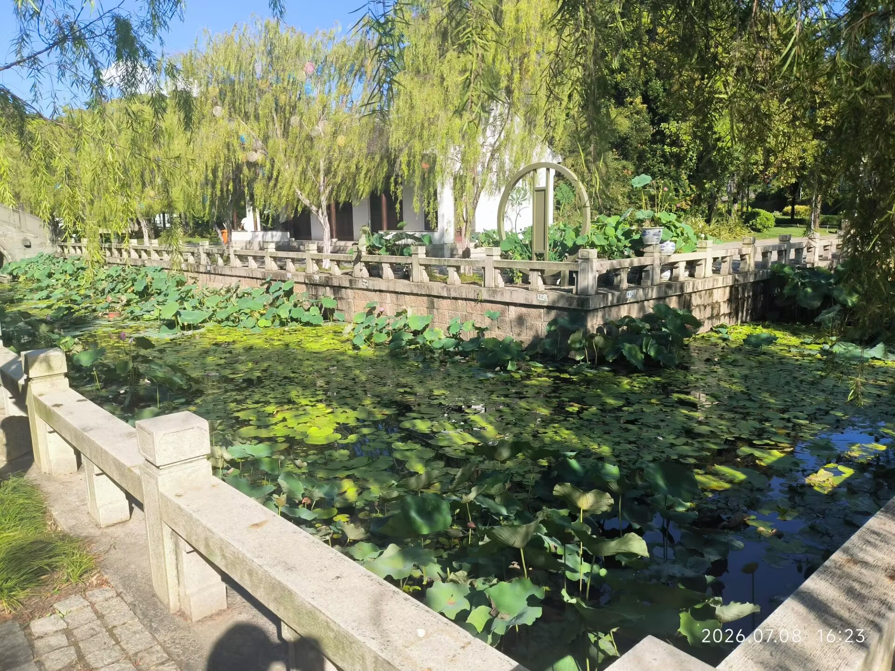

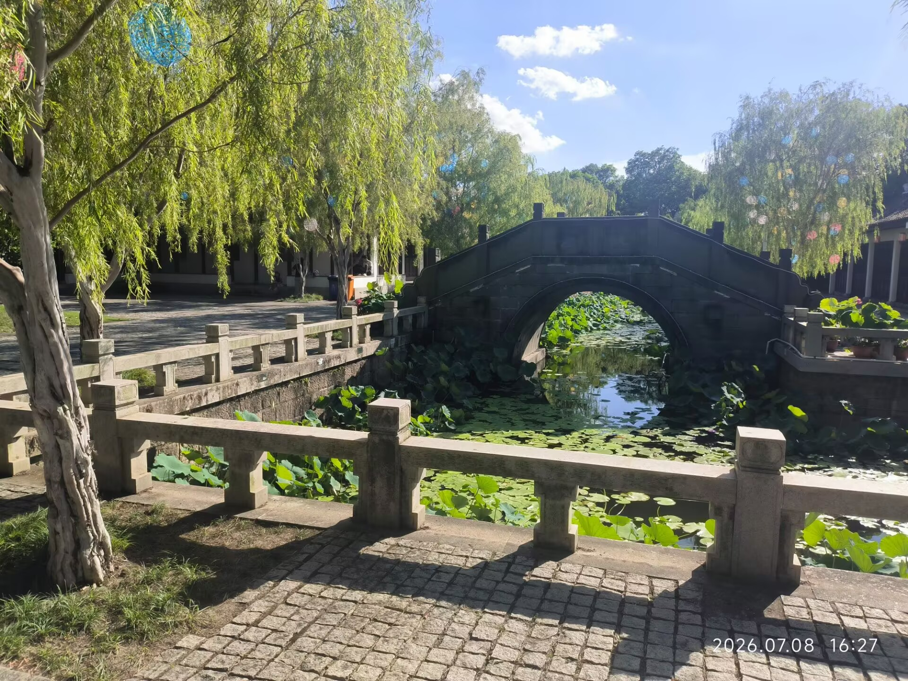

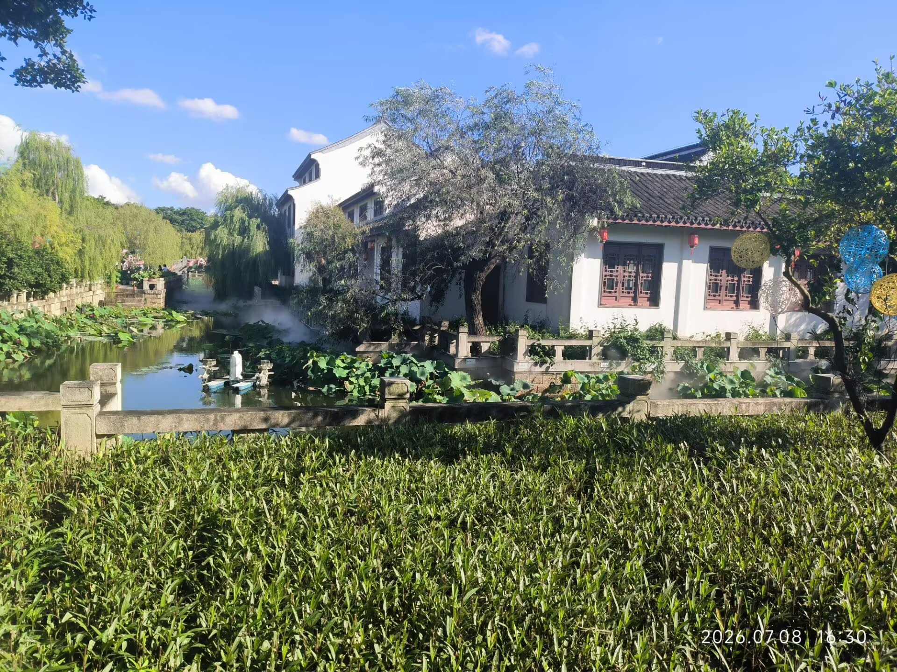

为了视觉效果，河道中还有喷雾

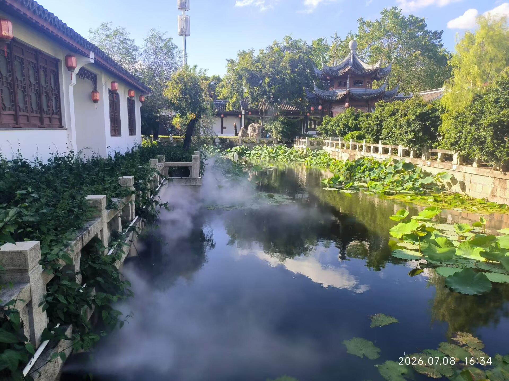

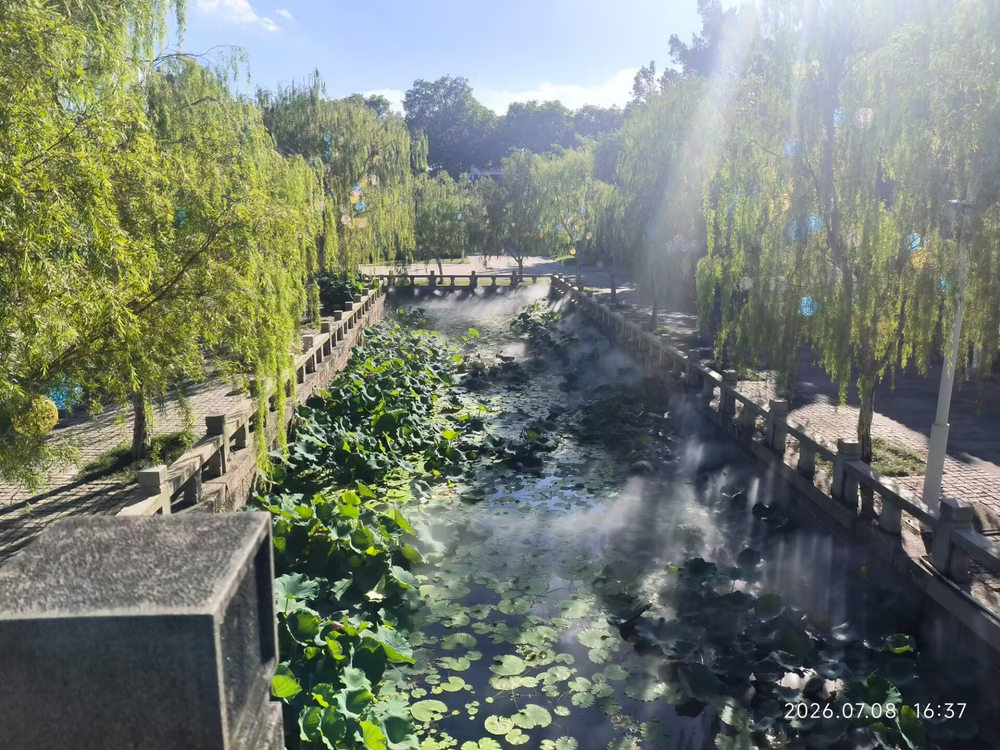

日光照射下，白雾似乎呈现出一定的丁达尔效应，出现一些可见的光束，漂浮在荷叶上，恍似仙境。可惜荷花尚未到时候，否则应该更美。

此外还有一些相当好的园林，我还看到了一处瀑布，但并没有拍。江南园林占据了我心头的大半，看罢我稍微转悠转悠也便离开了，预备下次再好好逛逛，毕竟时候也不早了。

回来之后似乎整个人更活了，肖邦的奏鸣曲忽而涌上心头，似乎在撺掇我去开谱玩玩，但那太难，还是算了。不过勾的我打算好好地练练谐谑曲了。总之，是让我苏生出了不少生机，让我想去做一些事情。这就很好，相较于此前浑浑噩噩的时候，这已经是极大的进步了。