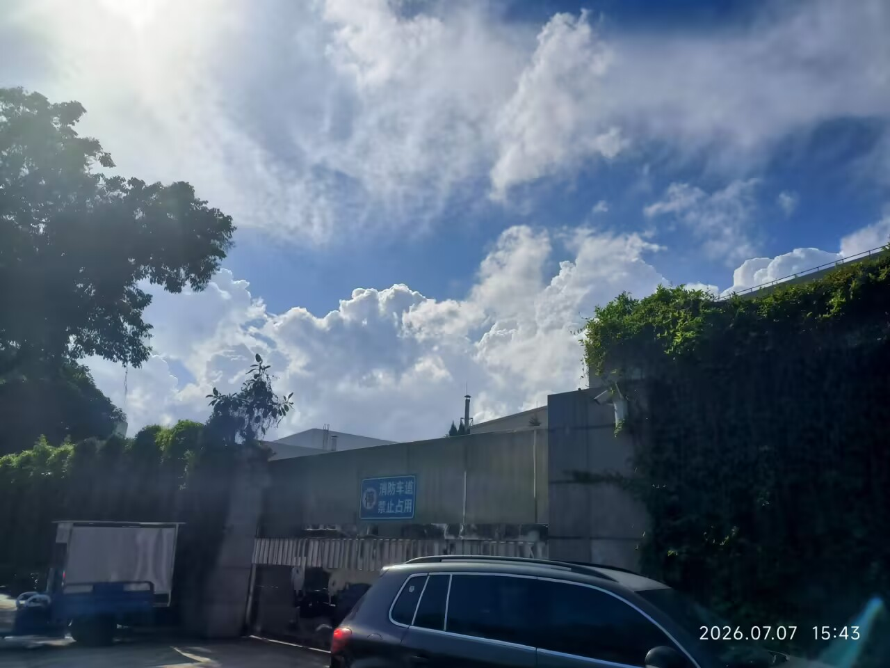
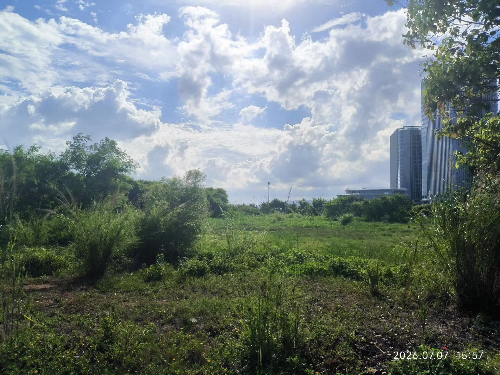
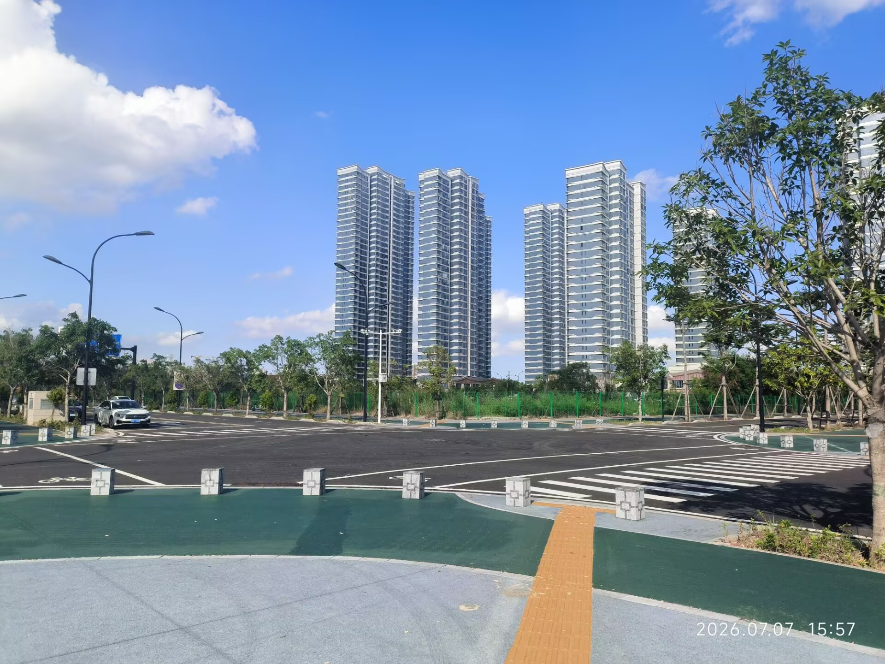
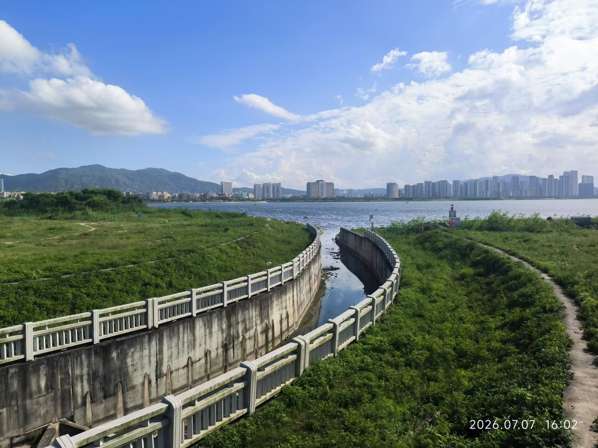
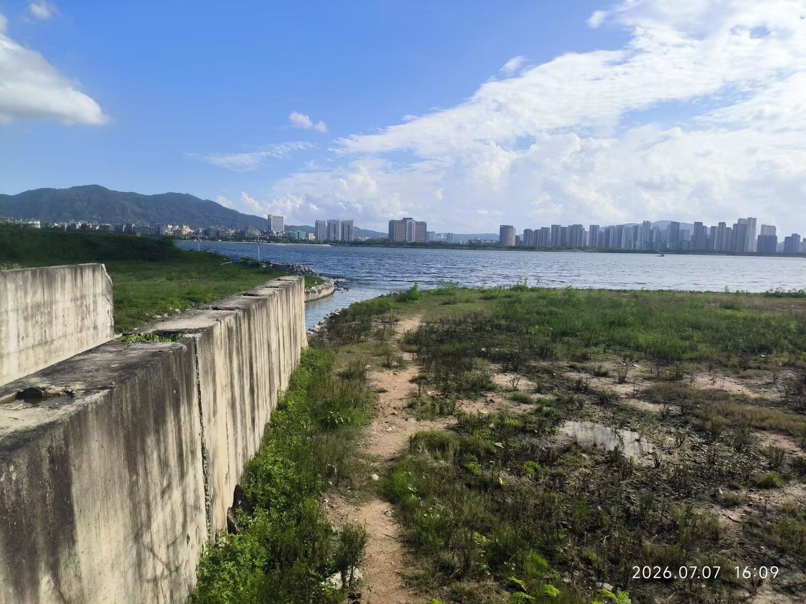
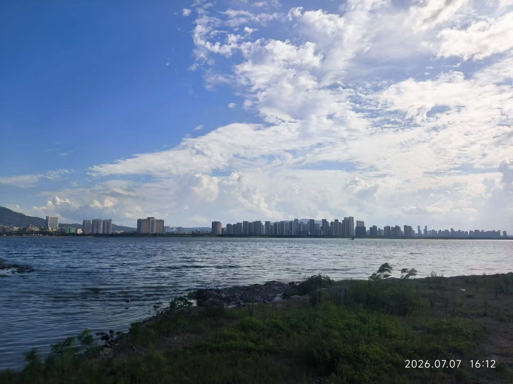
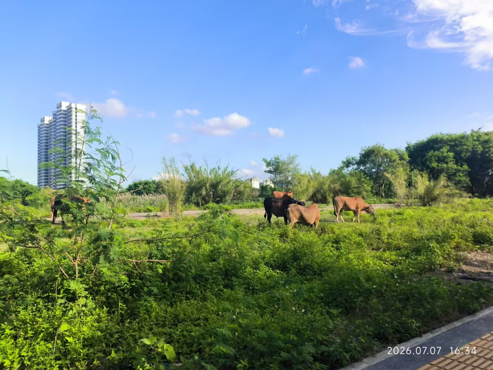

骑行~
几分钟车程，过去十几年竟然一次都没去过。

<!-- more -->

---

总是闷在家里，大约并不好，也会让人想出去走走。下午骑上小黄车到海边吹了吹风。

艳阳高照，白云反射日光，都毛茸茸地泛着雾化的白光，纯粹圣洁的白光，热烈美好的白光。

整个世界的色调都是明媚的，像宫崎骏的动画那样，蓬勃的，生机满满的，充满朝气与希望。

有一条小路通往海滩

但是走到那个标识牌，它会高声告诉你海边危险，让你返回。来都来了，怎么可能就这么回去了。沿着小路一路走到海边。海风呼呼吹着，海浪拍打着岸边，头顶是骄阳和成片的白云，这实在是极好的场景。随我走近海边，五六只白鹭刷地飞起，惊起一滩鸥鹭。我定睛一看，岸边还站着一只灰色的东西，似乎是夜鹭，久仰夜师傅大名，也在B站看了不少，倒是第一回亲眼见到。它比我想象的小，但是那猥琐的姿态非常符合我的印象，我没走近多少，它便也展翅飞走了，警觉半径相当高诶。

也没拍到，只有上图，无意中拍到了非常糊的鹭们。

滩上遍布着各样的石头，我于是想起打水漂，我从没试过，随手拿石头一试，扑通一下便沉了。无奈下打开b站学习了一番手法，终于能跳起来了，但是也跳的并不多，试了若干次，大部分弹两次或者干脆一次沉底，只有两次弹了三下。我看视频里那石头真是厉害，沿着水面如车轮快速滚动前行，足足能弹个二三十下。还真有不少门道，但是我没打算停留太久训练我的打水漂技术。我骑共享单车来，这附近是运营区外，还得预留回运营区的时间。学校虽然发了卡，只能免前一个小时。

回去路上，看到了几头牛，我说怎么来时闻到了牲畜粪便的味道。

回去的路上，走错了道，走到死路上了，原路返回再回去，花了不少时间，超过了一小时，痛失1r

回想过去的两周，放假在家，净日有种无所事事的感觉。学习并不想学，游戏也不想打，也懒得出门，对任何事情都提不起兴趣，浑浑噩噩，一晃过了两周这样混沌的生活。真是糟糕。每日想着怎么打发时间，又什么都不想做，偶然被小说勾起兴趣便看，看久了腻了又空虚，顺手刷刷社媒，刷一会又无聊……总在索求着即时的满足，一时的快感，却并不能够长久，只能让自己陷入无边的空虚。

或许是该多走走，虽然回来以后仍然什么都不那么想做，仍然感到空虚，但是缓和了不少，感到了一种持续性的满足，人似乎活了一点。而且在路上的时候心情十分畅快，若非时间限制我或许要骑个十几公里车去玩，明天吧？或许可以，不过科四我也许也该快快地考了，结束掉驾照这件事。看心情吧，也不急于一时，怎么高兴怎么干好了。放了假就狠狠摆摆好了，往后的寒暑假大约都会忙得很。